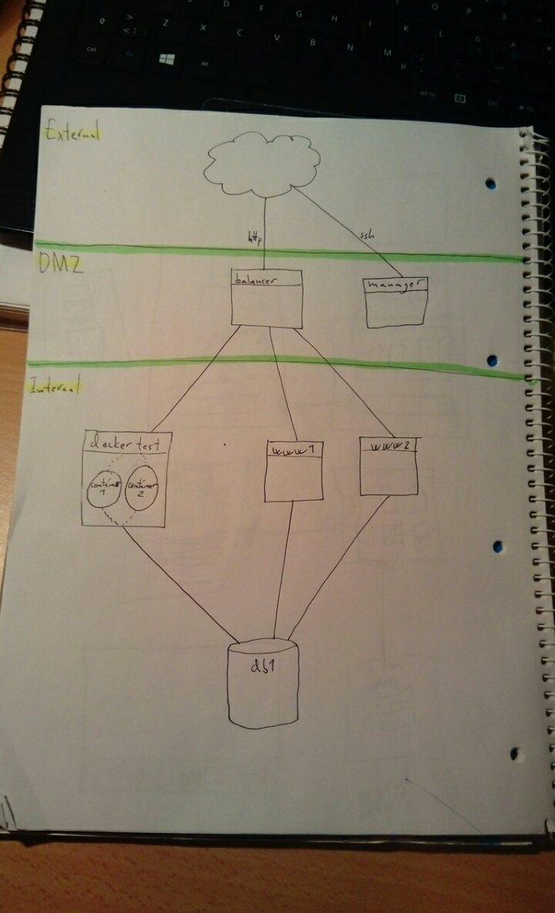

# Solutions to lab0202

# 1

Made new instance `dockertest`

* ubuntu 16.04 amd64
* medium size
* manager key

## Installing docker ce

Used this installation guide to install Docker CE: <https://docs.docker.com/install/linux/docker-ce/ubuntu/>

        sudo apt-get update

        sudo apt-get install \
            apt-transport-https \
            ca-certificates \
            curl \
            software-properties-common

        curl -fsSL https://download.docker.com/linux/ubuntu/gpg | sudo apt-key add -

        sudo apt-key fingerprint 0EBFCD88

        sudo add-apt-repository \
            "deb [arch=amd64] https://download.docker.com/linux/ubuntu \
            $(lsb_release -cs) \
            stable"

        sudo apt-get update

        sudo apt-get install docker-ce

        sudo docker run hello-world

Made it into a script that can be found in this directory under the name `dockerInstall.sh`

# 2

## Basic www container (interactive setup)

Made container with `docker run --name wwwtest2 -i -t ubuntu:16.04 /bin/bash`

Followed the instructions on installing bookface from previous lab (**NOTE**: Replaced all occurances of php5 with php).

Committed changes with `docker commit -m "somemessage" wwwtest2 wwwtest3`

Ran new container with same command as above, but exposed port 80 with `-p 80:80`

Have to manually start apache2 upon startup...

## Dockerfiled image (made after lab)

* Cloned down bookface from <https://git.cs.hioa.no/kyrre/bookface> and did the necessary preparations listed in the readme (making `config.php`, filling it with the appropriate values, etc.)
* Made a Dockerfile in the root of the repository that looks like this:

        FROM ubuntu:16.04
        MAINTAINER Thomas Løkeborg "thomahl@stud.ntnu.no" 

        # update and install all necessary services
        RUN apt-get -y update && apt-get -y install apache2 libapache2-mod-php php-mysql

        # ask nicely to expose port 80
        EXPOSE 80

        # start apache2 by default
        CMD /usr/sbin/apache2ctl -D FOREGROUND

  built it by doing `docker build -t dockerfiletest .` and run it by doing `docker run -v /home/ubuntu/bookface/code:/var/www/html -itd -P dockerfiletest`. Can spin up new containers with the same run command, and check their ports with `docker ps`

# 3

Started up two of the basic www containers. (Have to leave a shell open for each of them... This is bad, but did it cause we spent way too much time messing around with trying to get apache2 running on startup)

# 4

Added a backend definition to haproxy on manager by adding:

        backend dockerNodes
            mode http
            balance roundrobin
            server container1 10.10.1.5:36768 check
            server container1 10.10.1.5:36769 check

Made the server use the new backend by altering the default-

Changed the `default_backend` to dockerNodes

# 5

Diagram is in this directory with the name `infrastructure_diagram.jpg`

# 6

`docker ps -a` lists all containers (both running and stopped)

# 7

`docker rm` is used to remove a stopped docker instance

# 8

`--name` when doing `docker run`, `docker rename <OLD> <NEW>` when already created instance

# 9

According to our tests. no. Not by default

A quick google search shows that this is possible

# 10

You can ping the other container if you know it's IP address. By default the containers are started in the network "bridge". To check out their IPs you can run `docker inspect network bridge`

# 11

Docker swarm is where multiple machines running docker collaborate on running containers. Our architecture could benefit by us running both the db and the www servers in containers, allowing for easy horizontal scaling.

# 12

Yes we could do this. This means we could easily spin up more docker-enabled VMs to run our containers on. (This also means adding docker-enabled VMs to our swarm would be less painless)
